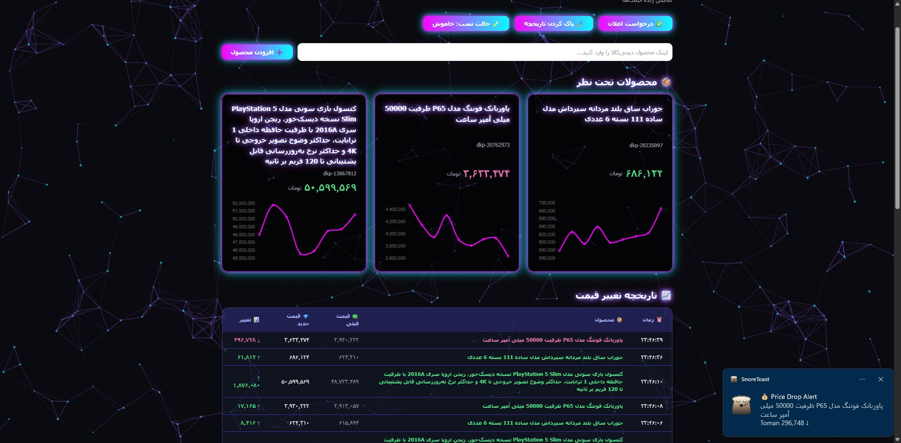
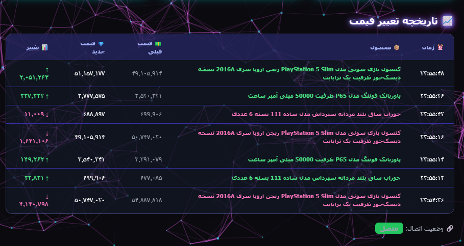

# 💎 Digikala Price Tracker    


یک ابزار **هوشمند و خودکار برای دنبال کردن قیمت محصولات دیجی‌کالا**  
با امکان **نوتیفیکیشن، ایمیل، تاریخچه قیمت و حالت تست**.  
این پروژه از **Puppeteer** برای اسکرپینگ و **Node.js** برای مدیریت و ذخیره داده‌ها استفاده می‌کند.
## 🎥 پیش‌نمایش (Demo)
<p align="center">
  
</p>

## 🖼️ تصایر پروژه

<p align="center">
  
  
  
</p>


---

## 🚀 ویژگی‌ها

- 🔄 پایش خودکار قیمت محصولات
- 💾 ذخیره تاریخچه قیمت‌ها در قالب **JSON** و **CSV**
- 🔔 نمایش اعلان دسکتاپ هنگام کاهش قیمت
- 📧 ارسال ایمیل هشدار در زمان کاهش قیمت
- 🧪 حالت تست برای شبیه‌سازی نوسان قیمت
- 🌐 داشبورد وب برای مشاهده‌ی محصولات و تغییرات قیمت

---

## 💻 پیش‌نیازها

قبل از اجرا مطمئن شوید که ابزارهای زیر نصب شده‌اند:

- [Node.js](https://nodejs.org/) نسخه 18 یا بالاتر  
- npm یا yarn  
- حساب Gmail (برای ارسال ایمیل)  
- دسترسی به ترمینال / Command Line  

---

## 📦 نصب پروژه

1. کلون کردن ریپازیتوری:

```bash
git clone https://github.com/USERNAME/Price-Tracker.git
cd Price-Tracker
```

2. نصب وابستگی‌ها:

```bash
npm install
# یا با yarn
yarn
```

---

## ⚙️ تنظیم فایل `.env`

در مسیر اصلی پروژه، یک فایل `.env` ایجاد کنید و اطلاعات زیر را وارد کنید:

```env
GMAIL_USER=your-email@gmail.com
GMAIL_PASS=your-app-password
EMAIL_TO=recipient@gmail.com
```

> ⚠️ نکته: رمز عبور معمولی Gmail کار نمی‌کند، باید App Password بسازید.  
> (Google Account → Security → App Passwords)

---

## 🧪 حالت تست (Test Mode)

اگر بخواهید تغییرات قیمت را به‌صورت تصادفی شبیه‌سازی کنید، در فایل `.env` بنویسید:

```env
TEST_MODE=true
```

یا از طریق **داشبورد وب** حالت تست را فعال یا غیرفعال کنید.  
در حالت تست، قیمت‌ها به‌صورت تصادفی افزایش یا کاهش پیدا می‌کنند تا عملکرد سیستم را بتوانید بررسی کنید.

---

## 🏃‍♂️ اجرای پروژه

در دو ترمینال مجزا اجرا کنید:

### ترمینال ۱ — اجرای سرور داشبورد:
```bash
node server.js
```
سپس در مرورگر وارد شوید:
```
http://localhost:3000
```

### ترمینال ۲ — اجرای اسکریپر:
```bash
node scrape-prices-puppeteer.js
```

برنامه به صورت خودکار هر **۳۰ ثانیه** قیمت محصولات را بررسی و تاریخچه تغییرات را ذخیره می‌کند.

---

## ✨ افزودن محصول جدید

برای اضافه کردن یک محصول جدید کافی است لینک محصول دیجی‌کالا را وارد کنید، مثل نمونه:

```
https://www.digikala.com/product/dkp-12345678/
```

در داشبورد روی **«افزودن محصول»** کلیک کنید  
یا مستقیماً لینک را در فایل اسکریپر وارد کنید تا شروع به پایش شود.

---

## 📊 خروجی‌ها

📁 مسیر ذخیره داده‌ها:  
`/price_history/`

هر محصول دو فایل دارد:
- `dkp-XXXX.json` → تاریخچه کامل قیمت‌ها  
- `dkp-XXXX.csv` → خروجی قابل خواندن در Excel  

همچنین فایل `alerts.log` شامل لیست تغییرات قیمت است.

---

## 🧠 توسعه و شخصی‌سازی

می‌توانید بازه‌ی بررسی قیمت را در فایل `scrape-prices-puppeteer.js` تغییر دهید:

```js
const CHECK_INTERVAL = 0.5 * 60 * 1000; // هر 30 ثانیه
```

و یا سیستم اعلان (notifier / email) را شخصی‌سازی کنید.

---

## 👩‍💻 توسعه‌دهنده

**Shaghayegh Tourang**  
📬 [GitHub Profile](https://github.com/Shaghayegh-t)


